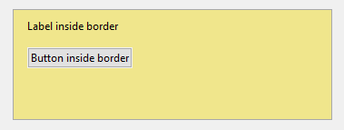
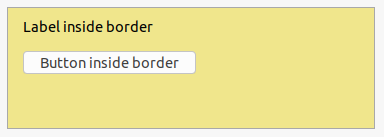

If you want to display a border around your content, you must place the elements within a parent <xref:Alternet.UI.Border> element.

Examples of how a <xref:Alternet.UI.Border> can look on different platforms:

# [Windows](#tab/screenshot-windows)

# [macOS](#tab/screenshot-macos)

# [Linux](#tab/screenshot-linux)

***