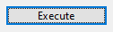

A button is one of the most commonly used UI controls. It is a designed to mimic a real-world push button. When user clicks on a button, the <xref:Alternet.UI.Control.Click>
event is raised. This event is then handled to execute some code in response to user clicking a button.

Examples of how a button can look on different platforms:
