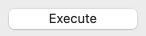
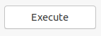

A button is one of the most commonly used UI controls. It is a designed to mimic a real-world push button. When user clicks on a button,
the <xref:Alternet.UI.Control.Click> event is raised.
This event is then handled to execute some code in response to user clicking a button.

Examples of how a button can look on different platforms:

|Windows|macOS|Linux|
|-------|-----|-----|
|||

Set <xref:Alternet.UI.ButtonBase.Text> property to specify the text displayed on the control.
A button, like any other <xref:Alternet.UI.Control>, can be disabled by setting its <xref:Alternet.UI.Control.Enabled> property to `false`.