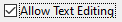

Use a <xref:Alternet.UI.CheckBox> to give the user an option, such as true/false or yes/no.
The <xref:Alternet.UI.CheckBox> control can display an image or text or both.
<xref:Alternet.UI.CheckBox> and <xref:Alternet.UI.RadioButton> controls have a similar function: they allow the user to
choose from a list of options. <xref:Alternet.UI.CheckBox> controls let the user pick a combination of options.
In contrast, <xref:Alternet.UI.RadioButton> controls allow a user to choose from mutually exclusive options.

Examples of how a <xref:Alternet.UI.CheckBox> can look on different platforms:

# [Windows](#tab/screenshot-windows)

# [macOS](#tab/screenshot-macos)

# [Linux](#tab/screenshot-linux)

***

Set <xref:Alternet.UI.ButtonBase.Text> property to specify the text displayed on the control.
A <xref:Alternet.UI.CheckBox>, like any other <xref:Alternet.UI.Control>, can be disabled by setting its <xref:Alternet.UI.Control.Enabled> property to `false`.