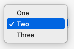

A <xref:Alternet.UI.ComboBox> displays a text box combined with a <xref:Alternet.UI.ListBox>, which enables the user
to select items from the list or enter a new value.
The <xref:Alternet.UI.ComboBox.IsEditable> property specifies whether the text portion can be edited.
To add or remove objects in the list at run time, use methods of the <xref:System.Collections.Generic.List`1> class
(through the <xref:Alternet.UI.ListControl.Items> property of the <xref:Alternet.UI.ComboBox>).
The list then displays the default string value for each object. You can add individual objects with the <xref:System.Collections.Generic.IList`1.Add> method.
You can delete items with the <xref:System.Collections.Generic.IList`1.Remove> method or clear the entire list with the <xref:System.Collections.Generic.IList`1.Clear> method.
In addition to display and selection functionality, the <xref:Alternet.UI.ComboBox> also provides features that enable you to
efficiently add items to the <xref:Alternet.UI.ComboBox> and to find text within the items of the list. With the <xref:Alternet.UI.Control.BeginUpdate>
and <xref:Alternet.UI.Control.EndUpdate> methods, you can add a large number of items to the <xref:Alternet.UI.ComboBox> without the control
being repainted each time an item is added to the list.
You can use the <xref:Alternet.UI.ComboBox.Text> property to specify the string displayed in the editing field,
the <xref:Alternet.UI.ComboBox.SelectedIndex> property to get or set the current item,
and the <xref:Alternet.UI.ComboBox.SelectedItem> property to get or set a reference to the selected object.

Examples of how a combobox can look on different platforms:

|Windows|macOS|Linux|
|-------|-----|-----|
|||

Set <xref:Alternet.UI.ComboBox.Text> property to specify the text displayed on the control.
A combobox, like any other <xref:Alternet.UI.Control>, can be disabled by setting its <xref:Alternet.UI.Control.Enabled> property to `false`.