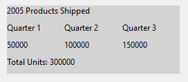
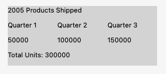

A <xref:Alternet.UI.Grid> contains a collection of <xref:Alternet.UI.Control> objects, which are in the <xref:Alternet.UI.Control.Children> property.

Child controls of a <xref:Alternet.UI.Grid> are drawn in the order in which they appear in UIXML or code. As a consequence, layered order (also known as z-order) can be achieved when controls share the same coordinates.

Child controls of a <xref:Alternet.UI.Grid> can be absolutely positioned relative to the upper-left corner of their "cell" boundaries.

Examples of how a <xref:Alternet.UI.Grid> can look on different platforms:

# [Windows](#tab/screenshot-windows)

# [macOS](#tab/screenshot-macos)

# [Linux](#tab/screenshot-linux)

***