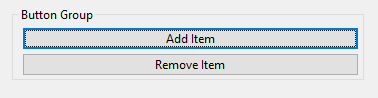
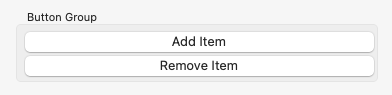
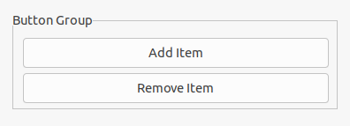

The <xref:Alternet.UI.GroupBox> displays a frame around a group of controls with or without a title.
Use a <xref:Alternet.UI.GroupBox> to logically group a collection of controls in a window.
The group box is a container control that can be used to define groups of controls.
The typical use for a group box is to contain a logical group of <xref:Alternet.UI.RadioButton> controls.
If you have two group boxes, each of which contain several option buttons (also known as radio buttons),
each group of buttons is mutually exclusive, setting one option value per group.
You can add controls to the <xref:Alternet.UI.GroupBox> by using the <xref:System.Collections.ObjectModel.Collection`1.Add*>
method of the <xref:Alternet.UI.Control.Children> property.

Examples of how a <xref:Alternet.UI.GroupBox> can look on different platforms:

# [Windows](#tab/screenshot-windows)

# [macOS](#tab/screenshot-macos)

# [Linux](#tab/screenshot-linux)

***

Set <xref:Alternet.UI.GroupBox.Title> property to specify the title text displayed on the control.