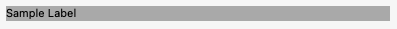
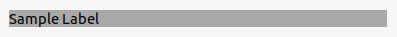

<xref:Alternet.UI.Label> controls are typically used to provide descriptive text for a control.
For example, you can use a <xref:Alternet.UI.Label> to add descriptive text for a <xref:Alternet.UI.TextBox> control to inform the
user about the type of data expected in the control. <xref:Alternet.UI.Label> controls can also be used
to add descriptive text to a <xref:Alternet.UI.Window> to provide the user with helpful information.
For example, you can add a <xref:Alternet.UI.Label> to the top of a <xref:Alternet.UI.Window> that provides instructions
to the user on how to input data in the controls on the form. <xref:Alternet.UI.Label> controls can also be used to display run time information on the status of an application. For example,
you can add a <xref:Alternet.UI.Label> control to a form to display the status of each file as a list of files is processed.

Examples of how a <xref:Alternet.UI.Label> can look on different platforms:

# [Windows](#tab/screenshot-windows)

# [macOS](#tab/screenshot-macos)

# [Linux](#tab/screenshot-linux)

***

Set <xref:Alternet.UI.Label.Text> property to specify the text displayed on the control.
A <xref:Alternet.UI.Label>, like any other <xref:Alternet.UI.Control>, can be disabled by setting its <xref:Alternet.UI.Control.Enabled> property to `false`.