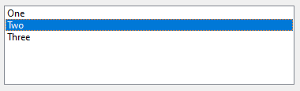
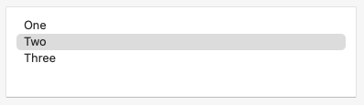
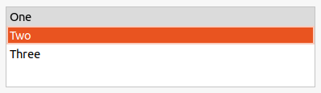

Examples of how a <xref:Alternet.UI.ListBox> can look on different platforms:

# [Windows](#tab/screenshot-windows)

# [macOS](#tab/screenshot-macos)

# [Linux](#tab/screenshot-linux)

***

A <xref:Alternet.UI.ListBox>, like any other <xref:Alternet.UI.Control>, can be disabled 
by setting its <xref:Alternet.UI.AbstractControl.Enabled> property to `false`.