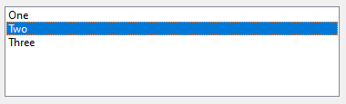
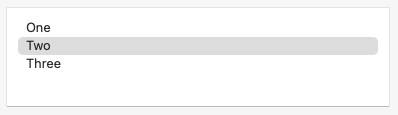

The <xref:Alternet.UI.ListBox> control enables you to display a list of items to the user that the user can select by clicking.
A <xref:Alternet.UI.ListBox> control can provide single or multiple selections using the <xref:Alternet.UI.ListBox.SelectionMode> property.
The <xref:Alternet.UI.Control.BeginUpdate> and <xref:Alternet.UI.Control.EndUpdate> methods enable
you to add a large number of items to the ListBox without the control being repainted each time an item is added to the list.
The <xref:Alternet.UI.ListControl.Items>, <xref:Alternet.UI.ListBox.SelectedItems>, and <xref:Alternet.UI.ListBox.SelectedIndices> properties provide access to the three
collections that are used by the <xref:Alternet.UI.ListBox>.

Examples of how a <xref:Alternet.UI.ListBox> can look on different platforms:

|Windows|macOS|Linux|
|-------|-----|-----|
|||

A <xref:Alternet.UI.ListBox>, like any other <xref:Alternet.UI.Control>, can be disabled by setting its <xref:Alternet.UI.Control.Enabled> property to `false`.