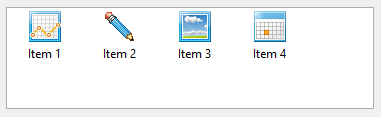
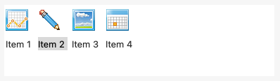
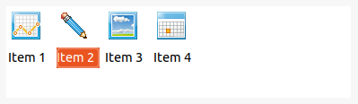

A <xref:Alternet.UI.ListView> control allows you to display a list of items with item text and, optionally, an icon to identify the type of item.
The <xref:Alternet.UI.ListViewItem> class represents an item within a ListView control.
The items that are displayed in the list can be shown in one of several different views.
Items can be displayed as large icons, as small icons, or as small icons in a vertical list.
Items can also be subdivided into columns in the <xref:Alternet.UI.ListViewView.Details> view, which allows you to display the items
in a grid with column headers. <xref:Alternet.UI.ListView> supports single or multiple selection.

Examples of how a <xref:Alternet.UI.ListView> can look on different platforms:

# [Windows](#tab/screenshot-windows)

# [macOS](#tab/screenshot-macos)

# [Linux](#tab/screenshot-linux)

***

A <xref:Alternet.UI.ListView>, like any other <xref:Alternet.UI.Control>, can be disabled by setting its <xref:Alternet.UI.Control.Enabled> property to `false`.