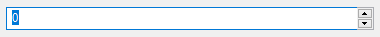
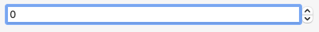
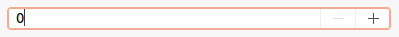

A <xref:Alternet.UI.NumericUpDown> control contains a single numeric value that can be incremented or decremented
by clicking the up or down buttons of the control.
To specify the allowable range of values for the control, set the <xref:Alternet.UI.NumericUpDown.Minimum> and <xref:Alternet.UI.NumericUpDown.Maximum> properties.

Examples of how a <xref:Alternet.UI.NumericUpDown> can look on different platforms:

# [Windows](#tab/screenshot-windows)

# [macOS](#tab/screenshot-macos)

# [Linux](#tab/screenshot-linux)

***

Set <xref:Alternet.UI.NumericUpDown.Value> property to specify the value assigned to the spin box.
A <xref:Alternet.UI.NumericUpDown>, like any other <xref:Alternet.UI.Control>, can be disabled by setting its <xref:Alternet.UI.Control.Enabled> property to `false`.