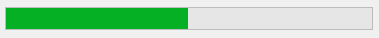

A <xref:Alternet.UI.ProgressBar> control visually indicates the progress of a lengthy operation.

The <xref:Alternet.UI.ProgressBar.Maximum> and <xref:Alternet.UI.ProgressBar.Minimum> properties define the range of values to
represent the progress of a task. The <xref:Alternet.UI.ProgressBar.Minimum> property is typically set to a value of 0,
and the <xref:Alternet.UI.ProgressBar.Maximum> property is typically set to a value indicating the completion of a task.
For example, to properly display the progress when copying a group of files,
the <xref:Alternet.UI.ProgressBar.Maximum> property could be set to the total number of files to be copied.
</para>
<para>
The <xref:Alternet.UI.ProgressBar.Value> property represents the progress that the application has made toward completing
the operation. The value displayed by the <xref:Alternet.UI.ProgressBar> only approximates the current value of the Value property.
Based on the size of the <xref:Alternet.UI.ProgressBar>, the <xref:Alternet.UI.ProgressBar.Value> property determines when to increase the size of
the visually highlighted bar.

Examples of how a <xref:Alternet.UI.ProgressBar> can look on different platforms:

# [Windows](#tab/screenshot-windows)

# [macOS](#tab/screenshot-macos)

# [Linux](#tab/screenshot-linux)

***

Set <xref:Alternet.UI.ProgressBar.Value> property to specify the current position of the progress bar.
A <xref:Alternet.UI.ProgressBar>, like any other <xref:Alternet.UI.Control>, can be disabled by setting its <xref:Alternet.UI.Control.Enabled> property to `false`.