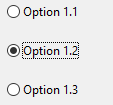
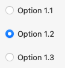
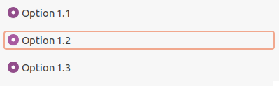

When the user selects one radio button (also known as an option button) within a group, the others clear automatically.
All <xref:Alternet.UI.RadioButton> controls in a given container, such as a <xref:Alternet.UI.Window>, constitute a group.
To create multiple groups on one window, place each group in its own container, such as a <xref:Alternet.UI.GroupBox>.

<xref:Alternet.UI.RadioButton> and <xref:Alternet.UI.CheckBox> controls have a similar function: they offer choices a user can select or clear.
The difference is that multiple <xref:Alternet.UI.CheckBox> controls can be selected at the same time, but option buttons are mutually exclusive.
</para>
<para>
Use the <xref:Alternet.UI.RadioButton.IsChecked> property to get or set the state of a <xref:Alternet.UI.RadioButton>.

Examples of how a <xref:Alternet.UI.RadioButton> can look on different platforms:

|Windows|macOS|Linux|
|-------|-----|-----|
|||

Set <xref:Alternet.UI.ButtonBase.Text> property to specify the text displayed on the control.
A <xref:Alternet.UI.RadioButton>, like any other <xref:Alternet.UI.Control>, can be disabled by setting its <xref:Alternet.UI.Control.Enabled> property to `false`.