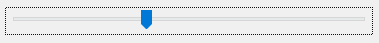
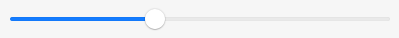
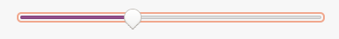

The <xref:Alternet.UI.Slider> is a scrollable control similar to the scroll bar control.
You can configure ranges through which the value of the <xref:Alternet.UI.Slider.Value> property of a
slider scrolls by setting the <xref:Alternet.UI.Slider.Minimum> property to specify the lower end
of the range and the <xref:Alternet.UI.Slider.Maximum> property to specify the upper end of the range.

The slider can be displayed horizontally or vertically.

You can use this control to input numeric data obtained through the <xref:Alternet.UI.Slider.Value> property.
You can display this numeric data in a control or use it in code.

Examples of how a <xref:Alternet.UI.Slider> can look on different platforms:

|Windows|macOS|Linux|
|-------|-----|-----|
|||

Set <xref:Alternet.UI.Slider.Value> property to represent the current position of the scroll box on the slider.
A <xref:Alternet.UI.Slider>, like any other <xref:Alternet.UI.Control>, can be disabled by setting its <xref:Alternet.UI.Control.Enabled> property to `false`.