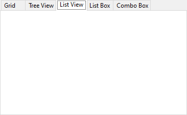
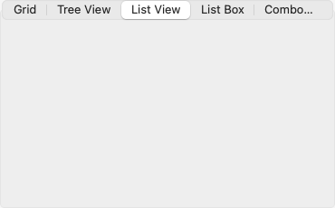

Examples of how a <xref:Alternet.UI.TabControl> can look on different platforms:

|Windows|macOS|Linux|
|-------|-----|-----|
|||

A <xref:Alternet.UI.TabControl>, like any other <xref:Alternet.UI.Control>, can be disabled by setting its <xref:Alternet.UI.Control.Enabled> property to `false`.