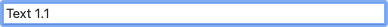
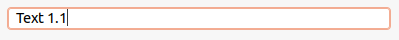
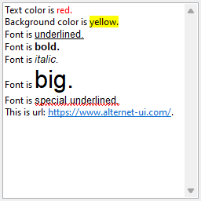

With the <xref:Alternet.UI.TextBox> control, the user can enter text in an application.

Examples of how a <xref:Alternet.UI.TextBox> can look on different platforms:

# [Windows](#tab/screenshot-windows)

# [macOS](#tab/screenshot-macos)

# [Linux](#tab/screenshot-linux)

***

Set <xref:Alternet.UI.TextBox.Text> property to specify the text displayed on the control.
A <xref:Alternet.UI.TextBox>, like any other <xref:Alternet.UI.Control>, can be disabled by setting its <xref:Alternet.UI.Control.Enabled> property to `false`.

<xref:Alternet.UI.TextBox> has rich edit capabilities. You can enable this feature by setting its 
<xref:Alternet.UI.TextBox.IsRichEdit> property to `true`.

