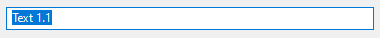

With the <xref:Alternet.UI.TextBox> control, the user can enter text in an application.

Examples of how a <xref:Alternet.UI.TextBox> can look on different platforms:

|Windows|macOS|Linux|
|-------|-----|-----|
|||

Set <xref:Alternet.UI.TextBox.Text> property to specify the text displayed on the control.
A <xref:Alternet.UI.TextBox>, like any other <xref:Alternet.UI.Control>, can be disabled by setting its <xref:Alternet.UI.Control.Enabled> property to `false`.