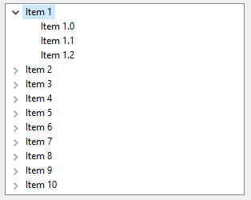
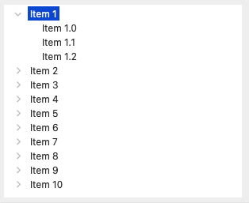
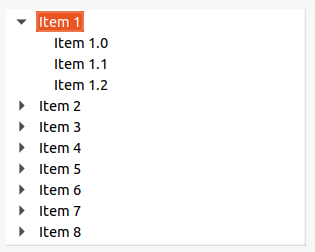

The <xref:Alternet.UI.TreeView.Items> collection holds all the <xref:Alternet.UI.TreeViewItem> objects that are assigned to the <xref:Alternet.UI.TreeView> control.
The items in this collection are referred to as the root items. Any item that is subsequently added to a root item is referred to as a child node.
Each <xref:Alternet.UI.TreeViewItem> can contain a collection of other <xref:Alternet.UI.TreeViewItem> objects.

You can display images next to the tree nodes by assigning an <xref:Alternet.Drawing.ImageList> to the <xref:Alternet.UI.TreeView.ImageList> property and
referencing the index value of an <xref:Alternet.Drawing.Image> in the <xref:Alternet.UI.TreeView.ImageList> to assign that <xref:Alternet.Drawing.Image>.
Set the <xref:Alternet.UI.TreeView.ImageIndex> property to the index value of the <xref:Alternet.Drawing.Image> that you want to display for all items by default.
Individual items can override the default images by setting the <xref:Alternet.UI.TreeViewItem.ImageIndex> property.

<xref:Alternet.UI.TreeView> items can be expanded to display the next level of child items.
The user can expand the <xref:Alternet.UI.TreeViewItem> by clicking the expand button, if one is displayed
next to the <xref:Alternet.UI.TreeViewItem>, or you can expand the <xref:Alternet.UI.TreeViewItem> by calling the <xref:Alternet.UI.TreeViewItem.Expand> method.
To expand all the child item levels in the <xref:Alternet.UI.TreeView.Items> collection, call the <xref:Alternet.UI.TreeViewItem.ExpandAll> method.
You can collapse the child <xref:Alternet.UI.TreeViewItem> level by calling the <xref:Alternet.UI.TreeViewItem.Collapse> method,
or the user can press the expand button, if one is displayed next to the <xref:Alternet.UI.TreeViewItem>.
You can also call the <xref:Alternet.UI.TreeViewItem.Toggle> method to alternate between the expanded and collapsed states.

Examples of how a <xref:Alternet.UI.TreeView> can look on different platforms:

# [Windows](#tab/screenshot-windows)

# [macOS](#tab/screenshot-macos)

# [Linux](#tab/screenshot-linux)

***

A <xref:Alternet.UI.TreeView>, like any other <xref:Alternet.UI.Control>, can be disabled by setting its <xref:Alternet.UI.Control.Enabled> property to `false`.