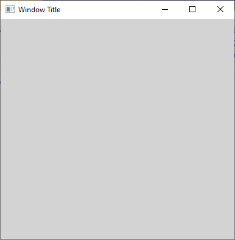
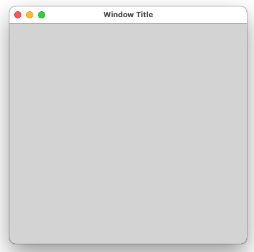
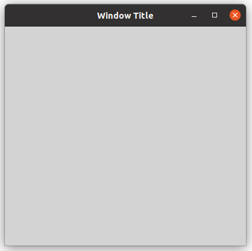

A <xref:Alternet.UI.Window> is a representation of any window displayed in your application.
The point of interaction between a user and a standalone application is a window. A <xref:Alternet.UI.Window> consists of two distinct areas:
- A non-client area, which hosts the windows adornments, including a title, minimize button, maximize button, close button, and a border.
- A client area, which hosts application-specific content.

Examples of how a <xref:Alternet.UI.Window> can look on different platforms:

# [Windows](#tab/screenshot-windows)

# [macOS](#tab/screenshot-macos)

# [Linux](#tab/screenshot-linux)

***

Set <xref:Alternet.UI.Window.Title> property to specify the title of this window.