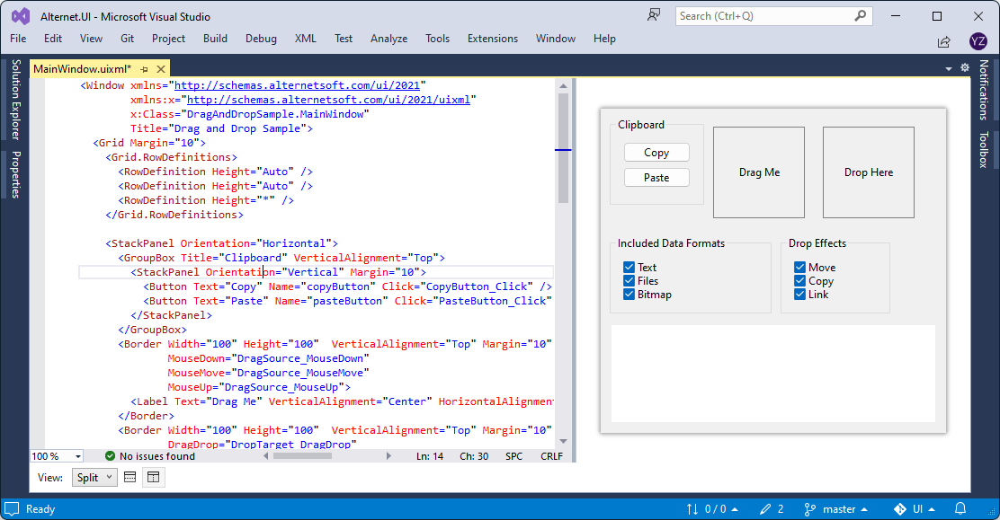
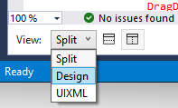
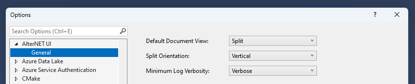

# Using UIXML Previewer in Visual Studio

[AlterNET UI extension for Visual Studio](https://marketplace.visualstudio.com/items?itemName=AlternetSoftwarePTYLTD.AlternetUIForVS2022) provides
the UIXML previewer feature. It allows for editing UIXML side-by-side with a live preview of the UI being edited.

Several UIXML previewer modes are available: *Split Horizontal*, *Split Vertical*, *Design* (only UIXML preview visible on screen), *UIXML* (only UIXML code editor visible on screen):

You can also set options for the UIXML previewer in the AlterNET UI Extension Options page (click *Tools*/*Options...* menu item, select AlterNET UI section):

