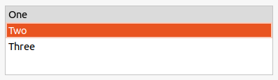

# Controls

AlterNET UI provides a set of standard controls which use native API and look and feel precisely like native elements on all platforms and different screen resolutions.

Examples of how a <xref:Alternet.UI.ListBox> can look on different platforms:

# [Windows](#tab/screenshot-windows)

# [macOS](#tab/screenshot-macos)

# [Linux](#tab/screenshot-linux)

***

AlterNET UI provides the following core controls:

**Containers**: <xref:Alternet.UI.Grid>, <xref:Alternet.UI.StackPanel>, <xref:Alternet.UI.VerticalStackPanel>, 
<xref:Alternet.UI.HorizontalStackPanel>, <xref:Alternet.UI.GroupBox>, <xref:Alternet.UI.Border>, 
<xref:Alternet.UI.TabControl>, <xref:Alternet.UI.SplittedPanel>, <xref:Alternet.UI.LayoutPanel>.

These controls act as containers for other controls and provide a different kinds of layouts in your windows.

A <xref:Alternet.UI.ScrollViewer> is a special kind of container which makes its child controls scrollable. 

**Inputs controls**: <xref:Alternet.UI.Button>, <xref:Alternet.UI.CheckBox>, <xref:Alternet.UI.ComboBox>, 
<xref:Alternet.UI.RadioButton>,
<xref:Alternet.UI.NumericUpDown>, <xref:Alternet.UI.TextBox>, <xref:Alternet.UI.DateTimePicker> and 
<xref:Alternet.UI.Slider>.

These controls most often detect and respond to user input. The control classes expose API to handle text and mouse input, focus management, and more.

**Data display**: <xref:Alternet.UI.ListBox>, <xref:Alternet.UI.StdListBox>, <xref:Alternet.UI.ListView>, <xref:Alternet.UI.TreeView>, 
<xref:Alternet.UI.CheckedListBox>, <xref:Alternet.UI.VirtualListBox>, <xref:Alternet.UI.PropertyGrid>.

These controls provide a visual representation of data elements in different layouts or views.

**Html display**: <xref:Alternet.UI.WebBrowser>.

This control may be used to render full featured web documents.

**Informational**: <xref:Alternet.UI.Label>, <xref:Alternet.UI.ProgressBar>.

These controls are designed to present information to the user in a visual form.

In AlterNET UI, each control is defined within a rectangle that represents its boundaries. The actual size of this rectangle is calculated by the
layout system at runtime using automatic measurements based on the available screen size, parent properties, and element properties such as border,
width, height, margin, and padding.