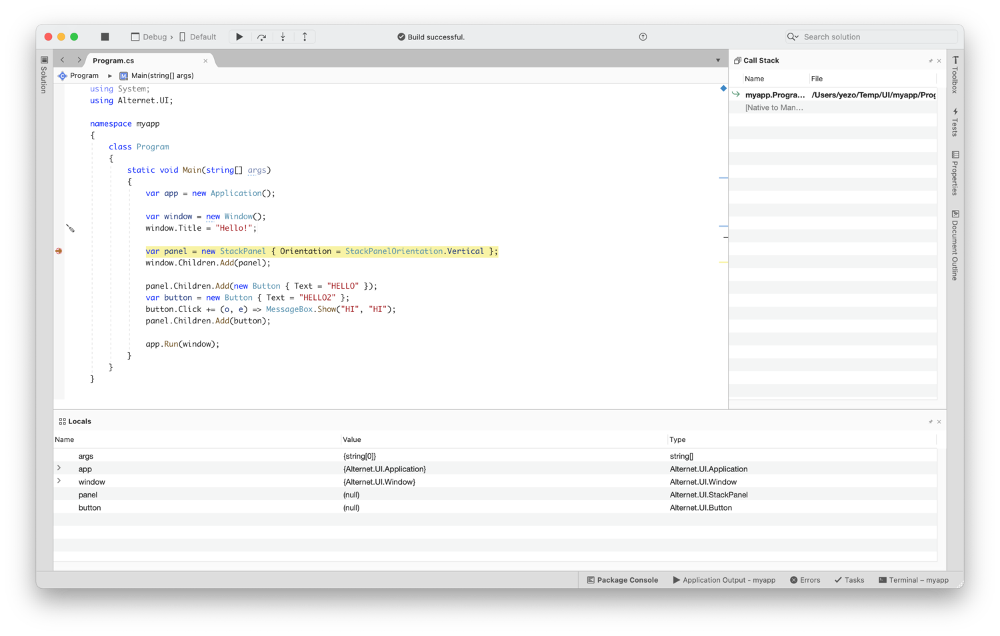

# Getting Started
To start with AlterNET UI you will need to download [AlterNET UI Visual Studio extension](https://marketplace.visualstudio.com/items?itemName=AlterNET-UI)
or install NuGet packages directly to your .NET Console project.
[AlterNET UI NuGet package](https://www.nuget.org/packages/Alternet.UI) contains all the necessary runtime libraries and design-time tasks
to build your project for different platforms.

### AlterNET UI Visual Studio Extension

The  AlterNET UI for Visual Studio extension extends Visual Studio with new Project type (AlterNET UI application) and a new project item type - UIXML,
which is a  declarative markup language that allows you to specify visible elements in your UI.

It also adds AlterNET UI Window project type allowing to create a new AlterNET UI Window from Add New Item dialog box. 

	<iframe width="560" height="315" src="https://www.youtube.com/embed/-XQhSPvUcDM?rel=0&amp;modestbranding=1" title="AlterNET UI Visual Studio Extension"
		frameborder="0" allow="accelerometer; autoplay; clipboard-write; encrypted-media; gyroscope; picture-in-picture" allowfullscreen vq=hd1080></iframe>

### Developing on macOS and Linux

You can use Visual Studio for Mac, Visual Studio Code and JetBrains Rider as your development environment on macOS and Linux, however AlterNET
Extension that supports automating of creation of a new project and UIXML documents is only available for Microsoft Visual Studio for Windows.

### Debugging AlterNET UI Code

You can download Source Code and PDB files of AlterNET UI from our GitHub repository. You can then add location to Tools->Options->Debugging->Symbols
to these PDB files, to enable source debugging in Visual Studio.

Todo: debugging in vs code.

Please note that we do not publish source code of platform - specific implementation layer.

### Downloads

[AlterNET UI NuGet package](https://www.nuget.org/packages/Alternet.UI)

[AlterNET UI Visual Studio extension](https://marketplace.visualstudio.com/items?itemName=AlterNET-UI)

---
*Read next*: [Programming with AlterNET UI](programming-with-alternet-ui.md)