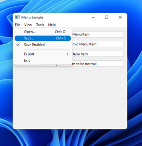
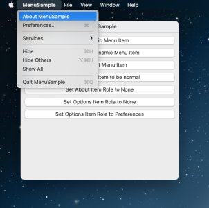
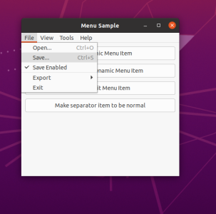

# Menu

AlterNET UI allows building menus on all the platforms it supports; see the screenshots below.

# [Windows](#tab/screenshot-windows)

# [macOS](#tab/screenshot-macos)

# [Linux](#tab/screenshot-linux)

***

The <xref:Alternet.UI.Menu> and <xref:Alternet.UI.MainMenu> classes enable you to organize elements associated with
commands and event handlers in a hierarchical order. Each <xref:Alternet.UI.Menu> element contains a collection of
<xref:Alternet.UI.MenuItem> elements.

## Menu Control  

The <xref:Alternet.UI.Menu> control presents a list of items that specify commands or options for an application.
Typically, clicking a <xref:Alternet.UI.MenuItem> opens a submenu or causes an application to execute a command.  
  
## Creating Menus  

The following example creates a <xref:Alternet.UI.MainMenu> with <xref:Alternet.UI.Menu> items inside. The
<xref:Alternet.UI.Menu> contains <xref:Alternet.UI.MenuItem> objects that use the
<xref:Alternet.UI.MenuItem.Command>,
<xref:Alternet.UI.MenuItem.Text>, <xref:Alternet.UI.MenuItem.Checked> properties and the <xref:Alternet.UI.Control.Click> event.  

[!code-xml]
  
[!code-csharp]

## MenuItems with Keyboard Shortcuts  
Keyboard shortcuts are character combinations that can be entered with the keyboard to invoke
<xref:Alternet.UI.Menu> commands. For example, the shortcut for **Copy** is CTRL+C. To assign
a keyboard shortcut to a menu item, use the <xref:Alternet.UI.MenuItem.Shortcut> property.

## MenuItem roles for macOS application menu support
On macOS, by the system UI guidelines, the **About**, **Quit**, and **Preferences** items must be placed into the application (the leftmost) menu.
They also should have standard names and keyboard shortcuts.
On Windows and Linux, these items are usually located in different menus, like **Help**, **File**, and **Tools**.
As many applications include these menu items, AlterNET UI provides automatic role-based menu item location adjustment on macOS.
Usually, the developer does not have to do anything, as the framework automatically deduces item roles from the menu item names and
relocates them to the required menu on macOS. For cases when more fine control is required, please use <xref:Alternet.UI.MenuItem.Role> property,
and <xref:Alternet.UI.MenuItemRoles> class.