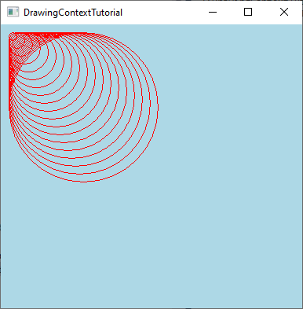
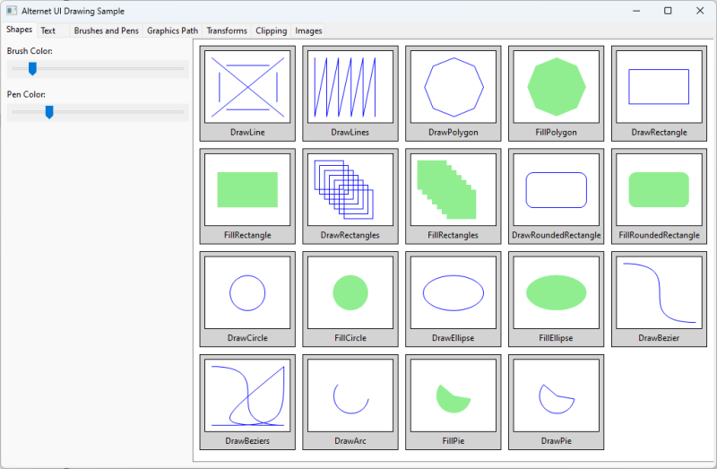
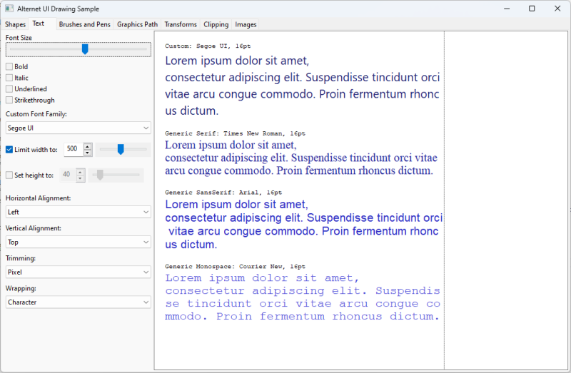
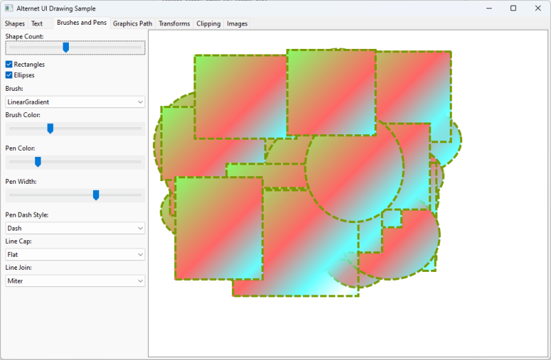
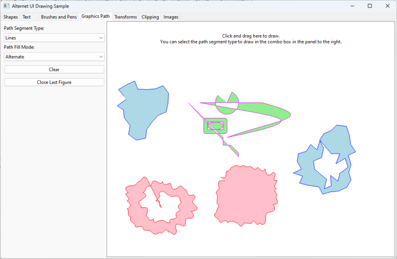
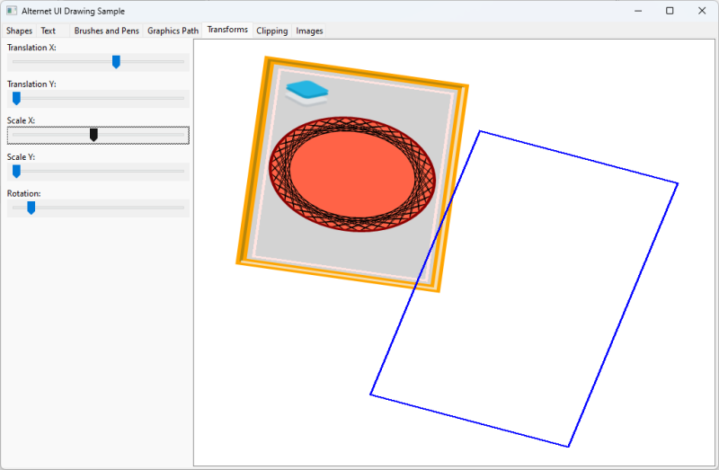
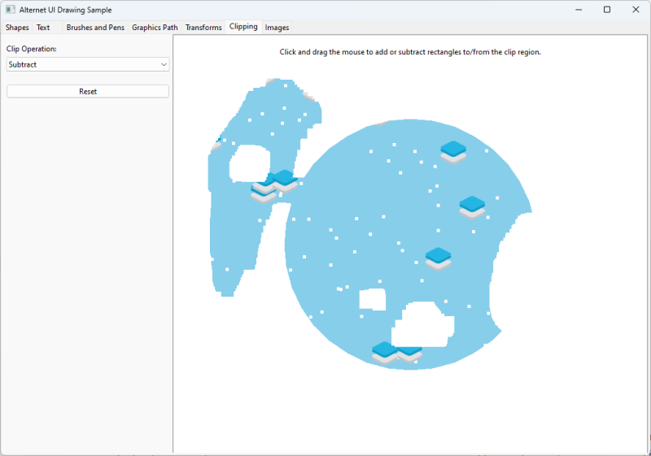
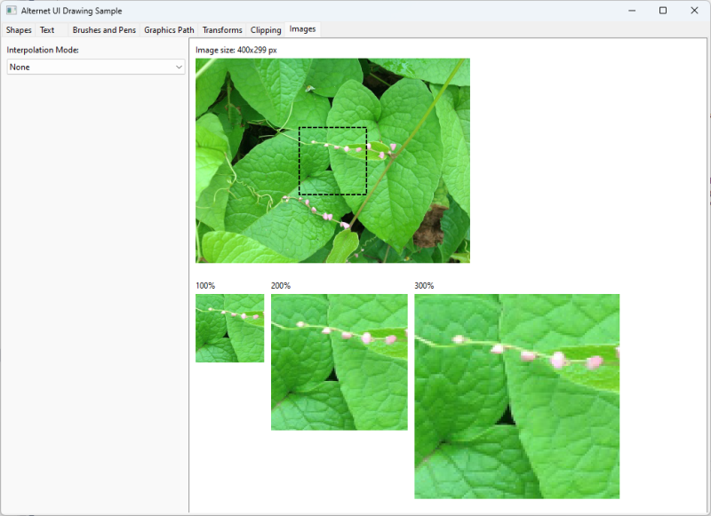

# Rendering Graphics

## Overview

AlterNET UI includes a set of resolution-independent graphics features that use native rendering on every supported platform.

It supports rendering graphic primitives such as text, images, and graphic shapes with different fonts, pens, and brushes.

The following code example illustrates how graphics can be drawn in a UI element:

[!code-csharp[](../../tutorials/drawing-context/examples/DrawingContextTutorial/DrawingControl-Step4.cs)]



Refer to our [blog post](https://www.alternet-ui.com/blog/drawing-context-tutorial) to see it in action.


## Drawing Context Features

Our [Drawing Sample](https://github.com/alternetsoft/alternet-ui-examples/tree/main/DrawingSample) illustrates the features AlterNET UI provides for rendering graphics.
Below is a list of the features that <xref:Alternet.Drawing.Graphics> provides, grouped by category.
The screenshots are taken from the [Drawing Sample](https://github.com/alternetsoft/alternet-ui-examples/tree/main/DrawingSample).

### Geometric Shapes

<xref:Alternet.Drawing.Graphics> class provides means to draw a variety of geometric shapes:



- Lines: <xref:Alternet.Drawing.Graphics.DrawLine%2A>, <xref:Alternet.Drawing.Graphics.DrawLines%2A>
- Polygons: <xref:Alternet.Drawing.Graphics.DrawPolygon%2A>, <xref:Alternet.Drawing.Graphics.FillPolygon%2A>
- Rectangles: <xref:Alternet.Drawing.Graphics.DrawRectangle%2A>, <xref:Alternet.Drawing.Graphics.FillRectangle%2A>,
  <xref:Alternet.Drawing.Graphics.DrawRectangles%2A>, <xref:Alternet.Drawing.Graphics.FillRectangles%2A>
- Rounded rectangles: <xref:Alternet.Drawing.Graphics.DrawRoundedRectangle%2A>, <xref:Alternet.Drawing.Graphics.FillRoundedRectangle%2A>
- Circles and ellipses: <xref:Alternet.Drawing.Graphics.DrawCircle%2A>, <xref:Alternet.Drawing.Graphics.FillCircle%2A>,
  <xref:Alternet.Drawing.Graphics.DrawEllipse%2A>, <xref:Alternet.Drawing.Graphics.FillEllipse%2A>
- Curves: <xref:Alternet.Drawing.Graphics.DrawBezier%2A>, <xref:Alternet.Drawing.Graphics.DrawBeziers%2A>
- Arcs and pies: <xref:Alternet.Drawing.Graphics.DrawArc%2A>, <xref:Alternet.Drawing.Graphics.DrawPie%2A>, <xref:Alternet.Drawing.Graphics.FillPie%2A>

### Text

<xref:Alternet.Drawing.Graphics> allows to draw text with the specified <xref:Alternet.Drawing.Font>, bounds, and <xref:Alternet.Drawing.TextWrapping>, <xref:Alternet.Drawing.TextTrimming>,
<xref:Alternet.Drawing.TextHorizontalAlignment> and <xref:Alternet.Drawing.TextVerticalAlignment>:



Here is an example of how to draw a wrapped, trimmed, and aligned text string:

```csharp
dc.DrawText(
    "My example text",
    Control.DefaultFont,
    Brushes.Black,
    new Rect(10, 10, 100, 100),
    new TextFormat
    {
        HorizontalAlignment = TextHorizontalAlignment.Center,
        VerticalAlignment = TextVerticalAlignment.Top,
        Wrapping = TextWrapping.Word,
        Trimming = TextTrimming.Character
    });
```

### Brushes and Pens

You can draw geometry with different stroke and fill styles provided by the <xref:Alternet.Drawing.Brush> and <xref:Alternet.Drawing.Pen> objects:



Below are the parts of the API responsible for different pen stroke styles:
- Solid lines: create an object of the <xref:Alternet.Drawing.Pen> class with a constructor that takes a
  <xref:Alternet.Drawing.Color> and line thickness value.
- Dashed lines: create an object of the <xref:Alternet.Drawing.Pen> class with a constructor that takes a
  <xref:Alternet.Drawing.DashStyle>, or set the <xref:Alternet.Drawing.Pen.DashStyle%2A> property.
- <xref:Alternet.Drawing.LineCap> and <xref:Alternet.Drawing.LineJoin> enumerations provide different line cap and line
  join styles.

The following classes allow you to fill geometry with different fill styles:
- Solid fill: use <xref:Alternet.Drawing.SolidBrush>
- Gradient fill: use <xref:Alternet.Drawing.RadialGradientBrush> and <xref:Alternet.Drawing.LinearGradientBrush>
- Pattern fill: use <xref:Alternet.Drawing.HatchBrush>


### GraphicsPath

<xref:Alternet.Drawing.GraphicsPath> class provides a way to stroke and fill geometric shapes defined with a series of connected lines and curves:



Here are the types of segments supported by the <xref:Alternet.Drawing.GraphicsPath>:

- Lines: <xref:Alternet.Drawing.GraphicsPath.AddLine%2A>, <xref:Alternet.Drawing.GraphicsPath.AddLines%2A>, <xref:Alternet.Drawing.GraphicsPath.AddLineTo%2A>
- Curves: <xref:Alternet.Drawing.GraphicsPath.AddBezier%2A>, <xref:Alternet.Drawing.GraphicsPath.AddBezierTo%2A>, <xref:Alternet.Drawing.GraphicsPath.AddArc%2A>
- Geometric shapes: <xref:Alternet.Drawing.GraphicsPath.AddEllipse%2A>, <xref:Alternet.Drawing.GraphicsPath.AddRectangle%2A>, <xref:Alternet.Drawing.GraphicsPath.AddRoundedRectangle%2A>

### Transforms

<xref:Alternet.Drawing.TransformMatrix> provides a way to set geometric transform to a <xref:Alternet.Drawing.Graphics>:



The transforms can include translation, rotation, and scale (see the
<xref:Alternet.Drawing.TransformMatrix.CreateTranslation%2A>, <xref:Alternet.Drawing.TransformMatrix.CreateRotation%2A>
and <xref:Alternet.Drawing.TransformMatrix.CreateScale%2A> methods). Use the
<xref:Alternet.Drawing.Graphics.Transform%2A> property of <xref:Alternet.Drawing.Graphics> to set the
current transform. The transforms can be applied sequentially with a stack-like approach, using the
<xref:Alternet.Drawing.Graphics.PushTransform%2A> and <xref:Alternet.Drawing.Graphics.PopTransform%2A> methods.

### Clip Regions

<xref:Alternet.Drawing.Region> class provides a way to set clip region to a <xref:Alternet.Drawing.Graphics>:



Use the <xref:Alternet.Drawing.Graphics.ClipRect%2A> or <xref:Alternet.Drawing.Graphics.ClipRegion%2A> methods 
of <xref:Alternet.Drawing.Graphics> to set clipping. Use the <xref:Alternet.Drawing.Graphics.Save%2A> and 
<xref:Alternet.Drawing.Graphics.Restore%2A> methods of <xref:Alternet.Drawing.Graphics> to
save/restore current clipping and transform.

### Drawing Images

<xref:Alternet.Drawing.Image> class encapsulate a graphical image.
<xref:Alternet.Drawing.Graphics.DrawImage%2A> method overloads provide several ways of drawing images with a
specified <xref:Alternet.Drawing.Graphics.InterpolationMode>:


