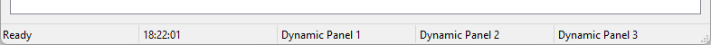
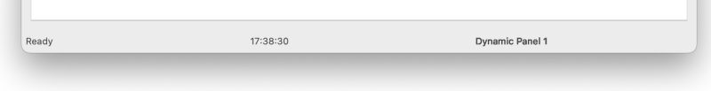
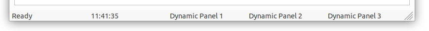

# Using StatusBar
  
The AlterNET UI <xref:Alternet.UI.StatusBar> control is used as an area, usually displayed
at the bottom of a window, in which an application can display various kinds of status information.
<xref:Alternet.UI.StatusBar> controls can have status bar panels on them that display text to indicate
state; for example, that the document is being saved.  
  
# [Windows](#tab/screenshot-windows)

# [macOS](#tab/screenshot-macos)

# [Linux](#tab/screenshot-linux)

***

## Using the StatusBar Control  
Internet Explorer uses a status bar to indicate the URL of a page when the mouse rolls over the hyperlink; Microsoft
Word gives you information on page location, section location, and editing modes such as overtype and revision tracking;
and Visual Studio uses the status bar to give context-sensitive information, such as telling you how to manipulate
dockable windows as either docked or floating.  
  
A status bar is divided into panels to display information by using the <xref:Alternet.UI.StatusBar.Panels> property.
The <xref:Alternet.UI.StatusBar> control allows you to create status bar panels by adding
<xref:Alternet.UI.StatusBarPanel> objects to a <xref:Alternet.UI.Toolbar.Items%2A> collection. Each
<xref:Alternet.UI.StatusBarPanel> object should have <xref:Alternet.UI.StatusBarPanel.Text> assigned in order to be
displayed in the status bar.

## Working with the StatusBar Control  

The following example shows how to use <xref:Alternet.UI.StatusBar> component:

```xml
<Window>
    <Window.StatusBar>
        <StatusBar Name="statusBar">
            <StatusBarPanel Text="Ready" />
            <StatusBarPanel Name="clockStatusBarPanel" />
        </StatusBar>
    </Window.StatusBar>
</Window>
```

```csharp
Timer clockTimer;

public MainWindow()
{
    InitializeComponent();

    clockTimer = new Timer(TimeSpan.FromMilliseconds(200), (o, e) => clockStatusBarPanel.Text = DateTime.Now.ToString("HH:mm:ss"));
    clockTimer.Start();
}
```