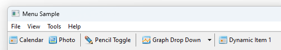
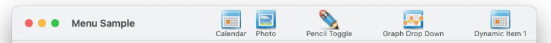
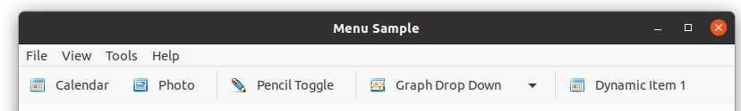

# Using Toolbars
  
The AlterNET UI <xref:Alternet.UI.Toolbar> control is used as a control bar that displays a row of drop-down menus and
bitmapped buttons that activate commands. Thus, clicking a toolbar button is equivalent to choosing a menu command. You can configure toolbar buttons to appear and behave as push buttons, drop-down menus, or separators. Typically, a toolbar
contains buttons and menus corresponding to items in an application's menu structure, providing quick access to an
application's most frequently used functions and commands.  

# [Windows](#tab/screenshot-windows)

# [macOS](#tab/screenshot-macos)

# [Linux](#tab/screenshot-linux)

***

## Working with the Toolbar Control  
A <xref:Alternet.UI.Toolbar> control is "docked" along the top of its parent window.
Use the <xref:Alternet.UI.Window.Toolbar> property to specify a toolbar associated with the window.

The <xref:Alternet.UI.Toolbar> control allows you to create toolbar items by adding
<xref:Alternet.UI.ToolbarItem> objects to a <xref:Alternet.UI.Toolbar.Items%2A> collection. Each
<xref:Alternet.UI.ToolbarItem> object should have <xref:Alternet.UI.ToolbarItem.Text> or an <xref:Alternet.UI.ToolbarItem.Image> assigned,
although you can assign both. The image is supplied by an associated <xref:Alternet.UI.ImageSet> component. At run time, you can
add or remove buttons from the <xref:Alternet.UI.Toolbar.Items%2A> collection. To program the items of a
<xref:Alternet.UI.Toolbar>, add code to the <xref:Alternet.UI.Control.Click> events of the
<xref:Alternet.UI.ToolbarItem> to determine which toolbar item was clicked.

Using <xref:Alternet.UI.ToolbarItem.IsCheckable> property, you can specify whether a <xref:Alternet.UI.ToolbarItem> can be "checked" or "toggled".
Use <xref:Alternet.UI.ToolbarItem.Checked> property to tell the check state of such items.

Use <xref:Alternet.UI.ToolbarItem.DropDownMenu> to specify a drop-down <xref:Alternet.UI.Menu> for a <xref:Alternet.UI.ToolbarItem>.

Set <xref:Alternet.UI.ToolbarItem>.<xref:Alternet.UI.ToolbarItem.Text> property to a *minus* ("-") value to use the item as a toolbar separator.

A toolbar can display tooltips when the user points the mouse pointer at a toolbar
button. A ToolTip is a small pop-up window briefly describing the button or menu's purpose.

The following example shows how to use <xref:Alternet.UI.Toolbar> component:

```xml
<Window>
    <Window.Toolbar>
        <Toolbar>
            <ToolbarItem Text="Calendar" Image="embres:MenuSample.Resources.Icons.Small.Calendar16.png"
                         Click="ToolbarItem_Click" ToolTip="Calendar Toolbar Item" />
            <ToolbarItem Text="-" />
            <ToolbarItem Text="Pencil Toggle" Image="embres:MenuSample.Resources.Icons.Small.Pencil16.png"
                         Click="ToggleToolbarItem_Click"
                         ToolTip="Pencil Toolbar Item" IsCheckable="true" Name="checkableToolbarItem" />
            <ToolbarItem Text="-" />
            <ToolbarItem Text="Graph Drop Down" ToolTip="Graph Toolbar Item"
                         Image="embres:MenuSample.Resources.Icons.Small.LineGraph16.png" Click="ToolbarItem_Click">
                <ToolbarItem.DropDownMenu>
                    <ContextMenu>
                        <MenuItem Text="_Open..." Name="openToolbarMenuItem" Click="ToolbarDropDownMenuItem_Click" />
                        <MenuItem Text="_Save..." Name="saveToolbarMenuItem" Click="ToolbarDropDownMenuItem_Click" />
                        <MenuItem Text="-" />
                        <MenuItem Text="E_xport..." Name="exportToolbarMenuItem" Click="ToolbarDropDownMenuItem_Click" />
                    </ContextMenu>
                </ToolbarItem.DropDownMenu>
            </ToolbarItem>
        </Toolbar>
    </Window.Toolbar>
</Window>
```

```csharp
private void ToolbarItem_Click(object? sender, EventArgs e)
{
    MessageBox.Show("Toolbar item clicked: " + ((ToolbarItem)sender!).Text);
}

private void ToggleToolbarItem_Click(object sender, EventArgs e)
{
    var item = (ToolbarItem)sender;
    MessageBox.Show($"Toggle toolbar item clicked: {item.Text}. Is checked: {item.Checked}");
}

private void ToolbarDropDownMenuItem_Click(object sender, EventArgs e)
{
    var item = (MenuItem)sender;
    MessageBox.Show($"Toolbar drop down menu item clicked: {item.Text.Replace("_", "")}.");
}
```
