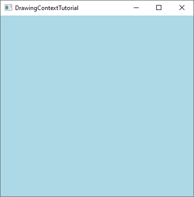

# Rendering with Graphics

This tutorial will teach you how to create a custom <xref:Alternet.UI.Control>, which draws itself on the
 screen using <xref:Alternet.Drawing.Graphics> class.

1. Create a new AlterNET UI Application project, name it `DrawingContextTutorial`. For step-by-step guidance
 on how to create a new AlterNET UI project,
    see ["Hello, World" Tutorial](../hello-world/hello-world.md).
1. Add a new empty class named `DrawingControl` to the project. Make the class `public`, and derive it
 from <xref:Alternet.UI.Control>:
   [!code-csharp]
1. Open `MainWindow.uixml`. Add the reference to the local namespace, and add a `DrawingControl` to the window:
   [!code-xml]
1. Compile and run the application. An empty window will appear. This is because `DrawingControl` does not paint itself yet.
1. In the `DrawingControl` class, add a default constructor. In its body, set <xref:Alternet.UI.Control.UserPaint> 
property to `true`. Also,
   override the <xref:Alternet.UI.Control.OnPaint*> method:
   [!code-csharp]
1. In the overridden `OnPaint` method, add the following
   <xref:Alternet.Drawing.Graphics.FillRectangle*?text=Graphics.FillRectangle> call to
   paint the control's background <xref:Alternet.Drawing.Brushes.LightBlue>:
   [!code-csharp]
1. Build and run the application. The displayed window will have a light blue background:

   
1. In the overridden `OnPaint` method, add the following two lines of code to paint a red circular pattern:
   [!code-csharp]
1. Build and run the application. The displayed window will look like the following:

   
1. Now, let's draw a simple line of text. To do that, we will create a cached <xref:Alternet.Drawing.Font> instance, and
   draw a text line using the <xref:Alternet.Drawing.Graphics.DrawText*?text=Graphics.DrawText> method:
   [!code-csharp]
1. Build and run the application. The displayed window will look like the following:

   

1. To demonstrate how <xref:Alternet.Drawing.Graphics.DrawText*?text=Graphics.MeasureText> works, let's draw
   the names of the three spring months one under another:
   [!code-csharp]
1. Build and run the application. The displayed window will look like the following:

   

---
*Congratulations, you have completed the Rendering Graphics with DrawingContext tutorial.*