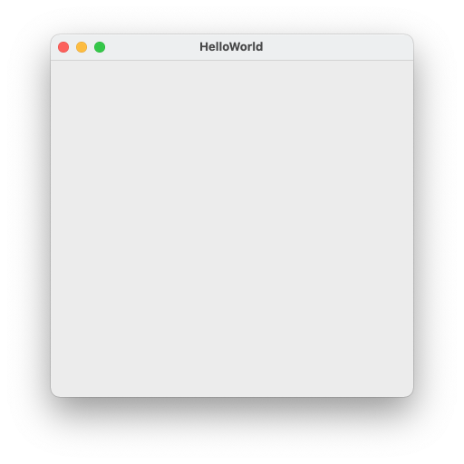
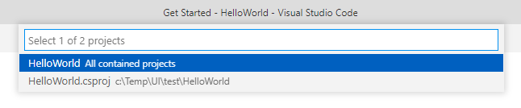
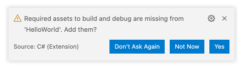
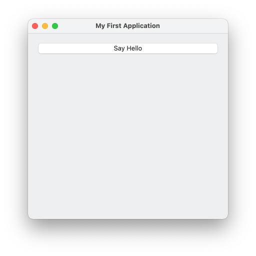
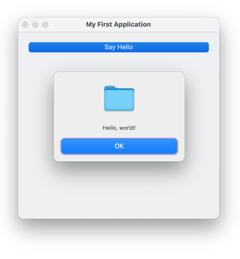

#  "Hello, World" with Command-Line and Visual Studio Code

In this tutorial, you will create a cross-platform desktop application using C#, .NET command line tools, and Visual Studio Code.
The application will display a message box in response to a button click.

### Prerequisites

1. Download and install [.NET SDK](https://dotnet.microsoft.com/download/dotnet). The minimum supported SDK version is .NET 8.0.
1. Install AlterNET UI project templates by running
    ```dos
    dotnet new install Alternet.UI.Templates
    ```
1. Download and install [Visual Studio Code](https://code.visualstudio.com/download)
1. In Visual Studio Code, ensure the [C# extension](https://marketplace.visualstudio.com/items?itemName=ms-dotnettools.csharp) is installed. For
   information about how to install extensions on Visual Studio Code, see [VS Code Extension Marketplace](https://code.visualstudio.com/docs/editor/extension-gallery).
1. If you develop under Linux, please install required packages as described at the end of this page.

### Create New Project

1. Create a new directory for your application; name it `HelloWorld`
1. Open the **Command Prompt** window (**Terminal** on macOS or Linux)
1. Navigate the terminal to the created directory:
    ```dos
    cd path/to/HelloWorld
    ```
1. Enter the following command to create a new project in the current directory:
    ```dos
    dotnet new alternet-ui
    ```
1. The following files will be created:
    ```
    HelloWorld.csproj
    MainWindow.uixml
    MainWindow.uixml.cs
    Program.cs
    ```
1. Compile and run the created project by executing:
    ```dos
    dotnet run
    ```
The application will start and display its window:



> [!NOTE]
> By default, the created project will use .NET 8.0 as a target framework. If .NET 8.0 runtime is not installed on your machine, you
> will be prompted to do so on the first application run.

> [!NOTE]
> You can also create .cs/.uixml files for a new window from the console like this:
> ```dos
> dotnet new alternet-ui-window -n MyNewWindow --namespace Test1
> ```
> Where `MyNewWindow` is a name for a new window class, and `Test1` is the created class namespace name.

### Open Project with Visual Studio Code

1. Start Visual Studio Code.
1. Select **File** > **Open Folder** (**File** > **Open...** on macOS) from the main menu.
1. In the **Open Folder** dialog, locate a *HelloWorld* folder and click **Select Folder** (**Open** on macOS).
1. The popup prompting **Select 1 of 2 projects** will appear at the top of the screen:
   
   
   
   Select **All contained projects**.

1. After several seconds, a popup dialog with the message **Required assets to build and debug are missing from 'HelloWorld'. Add them?** will appear at
   the bottom-right corner of the screen:
   
   

   Select **Yes**. The `.vscode` subdirectory will be created with the workspace settings automatically set up.
1. Now, you can debug your application by pressing `F5` or run it without debugging by pressing `Ctrl+F5`.
   The application will be built automatically if required.
1. Open `MainWindow.uixml` by clicking the corresponding item in the VS Code **Explorer** panel. In the editor, change the `Title` attribute value from
   `"HelloWorld"` to `"My First Application"`:
   [!code-xml[](../examples/change-title.uixml?highlight=4)]
1. Press `Ctrl+F5` to build and run the application and see its window title has changed accordingly.

> [!NOTE]
> For information and tutorials on general C# development and debugging with Visual Studio Code, see the
> [corresponding MSDN article](https://docs.microsoft.com/en-us/dotnet/core/tutorials/with-visual-studio-code).

### Uixml Syntax Highlight

In order to have syntax highlight in uixml, you need:

- Create '.vscode' subfolder in you project folder.
- Create there 'settings.json' file.
- Edit 'settings.json' and add there 'files.associations' section:

```json
{
	"files.associations": {
	    "*.uixml": "xml",
	}
}
```

### Add Button to the Window

1. In `MainWindow.uixml`, add the following markup:
   [!code-xml[](../examples/add-button.uixml?highlight=5-7)]
1. Run the application by pressing `Ctrl+F5`:
   
   

### Write Code to Respond to the Button Click

1. In `MainWindow.uixml`, add the `Click` attribute to the `Button` element like the following:
   [!code-xml[](../examples/add-click-handler.uixml?highlight=6)]
   This will bind the `Click` event to its handler, ' HelloButton_Click`.
1. In `MainWindow.uixml.cs` file, add the following `HelloButton_Click` method:
   [!code-csharp[](../examples/add-click-handler.uixml.cs?highlight=1,13-16)]
1. Run the application, then click **Say Hello** button. The message box appears:

   

> [!NOTE]
> The application created in this tutorial can be compiled and run without source code modifications
>  on all the supported platforms: Windows, macOS, and Linux.

### Linux

Before running Alternet.UI applications on Linux, you need to install
required packages. There is special installation script for Ubuntu.
You can download it from the 
[GitHub repository](https://github.com/alternetsoft/AlternetUI)
 (File: Install.Scripts/Ubuntu.Install.Packages.sh).
This is development packages, end-users do not need to install all of them.

---
*Congratulations, you have completed the "Hello, World" tutorial using command line tools and Visual Studio Code.*

*For a similar tutorial but using Visual Studio on Windows, see ["Hello, World" with Visual Studio](../visual-studio/hello-world-visual-studio.md).*
