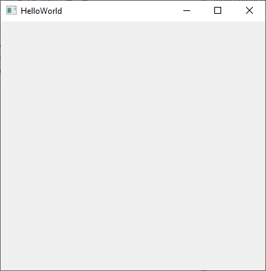

# "Hello, World" with Visual Studio

In this tutorial, you will create a cross-platform desktop application using C# and Microsoft Visual Studio.
The application will display a message box in response to a button click.

Microsoft Visual Studio is supported on Windows OS only.
To develop on macOS or Linux, see ["Hello, World" with Command-Line and VS Code](../command-line/hello-world-command-line.md).

### Prerequisites

1. Install [Microsoft Visual Studio](https://visualstudio.microsoft.com/vs/). Visual Studio 2022 is supported.
1. Ensure the ".NET Desktop Development" or "ASP.NET and web development" workflow is installed.
1. Download and install [AlterNET UI Visual Studio extension](https://marketplace.visualstudio.com/items?itemName=AlternetSoftwarePTYLTD.AlternetUIForVS2022).

### Create New Project

1. Open Visual Studio, and in the start window, select **Create new project**.
1. On the **Create new project** page, locate the AlterNET UI Application template. Select it, then click **Next**.
    
1. On the **Configure your new project** page set the project name to `HelloWorld` and specify the desired project location. When done, click
   **Create**.
1. The project will be created, and you will be presented with a development environment.
    
1. Press `Ctrl+F5` to build and run the application. The application will start and display its window:

   

1. In Visual Studio, open `MainWindow.uixml`. In the editor, change the `Title` attribute value from
   `"HelloWorld"` to `"My First Application"`:
   [!code-xml]
1. Press `Ctrl+F5` to build and run the application and see its window title has changed accordingly.

> [!NOTE]
> By default, the created project will use .NET 8.0 as a target framework. If .NET 8.0 runtime is not installed on your machine, you
> will be prompted to do so on the first application run.

### Add Button to the Window

1. In `MainWindow.uixml`, add the following markup:
   [!code-xml]
1. Run the application by pressing `Ctrl+F5`:
   
   

### Write Code to Respond to the Button Click

1. In `MainWindow.uixml`, add the `Click` attribute to the `Button` element like the following:
   [!code-xml]
   This will bind the `Click` event to its handler, ' HelloButton_Click`.
1. In `MainWindow.uixml.cs` file, add the following `HelloButton_Click` method:
   [!code-csharp]
1. You can use IntelliSense features provided by the [AlterNET UI Visual Studio Extension](https://marketplace.visualstudio.com/items?itemName=AlternetSoftwarePTYLTD.AlternetUIForVS2022):

    

1. Run the application, then click **Say Hello** button. The message box appears:

   

> [!NOTE]
> The application created in this tutorial can be compiled and run without modifications on all the supported platforms: Windows, macOS, and Linux.

---
*Congratulations, you have successfully completed the "Hello, World" tutorial using Microsoft Visual Studio.*

*For a similar tutorial, but using command line tools and Visual Studio Code, see ["Hello, World" with Command-Line and Visual Studio Code](../command-line/hello-world-command-line.md).*
