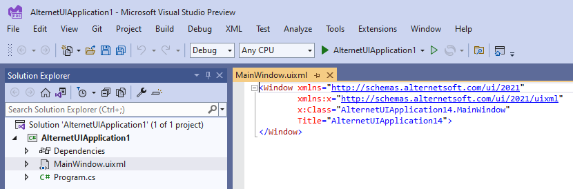

# Quick Start Tutorial

In this tutorial you will create a cross-platform desktop application which displays a message box in response to a button click.

### 1. Install Prerequisites

The required prerequisites depend on whether you use Visual Studio or command line tools in your development workflow.
We recommend Visual Studio on Windows operating system, and command line tools with Visual Studio Code on macOS and Linux.

# [Visual Studio](#tab/prerequisites-visual-studio)

- Install [Microsoft Visual Studio](https://visualstudio.microsoft.com/vs/community/). Visual Studio 2019 and Visual Studio 2022 are supported.
- Make sure ".NET Desktop Development" or "ASP.NET and web development" workflow is installed.
- Download and install [AlterNET UI Visual Studio extension](https://marketplace.visualstudio.com/items?itemName=AlterNET-UI).

# [Command Line with VS Code](#tab/prerequisites-command-line)

- Download and install [.NET SDK](https://dotnet.microsoft.com/download/dotnet). Minimum supported SDK version is .NET Core 3.1.
- Download and install [Visual Studio Code](https://code.visualstudio.com/download)
- In Visual Studio Code, make sure the [C# extension](https://marketplace.visualstudio.com/items?itemName=ms-dotnettools.csharp) is installed.

***

> [!NOTE]
> By default the created project will use .NET Core 3.1 as a target framework. If .NET Core 3.1 runtime is not installed on your machine you
> will be prompted to do so on the first application run.

### 2. Create New Project

# [Visual Studio](#tab/create-new-project-visual-studio)

- Open Visual Studio, in the start window select **Create new project**.
- On the **Create new project** page, locate the AlterNET UI Application template. Select it, click **Next**.

- On the **Configure your new project** page set the desired project name and location, then click **Create**.
- The project will be created and you will be presented with a familiar project environment.

# [Command Line with VS Code](#tab/create-new-project-command-line)

***
