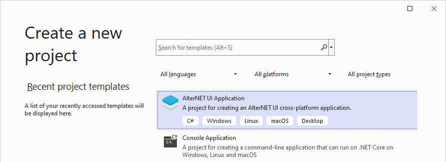
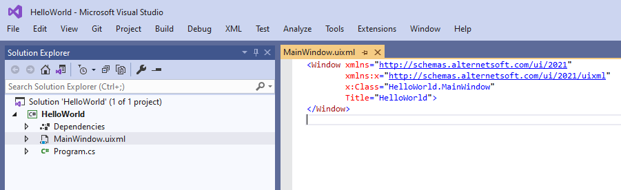

# Quick Start with Visual Studio

In this tutorial you will create a cross-platform desktop application using C# and Microsoft Visual Studio.
The application will display a message box in response to a button click.

Microsoft Visual Studio is supported on Windows OS only.
To develop on macOS or Linux, see [Quick Start with Command Line and VS Code](../command-line/quick-start-command-line.md).

### Prerequisites

1. Install [Microsoft Visual Studio](https://visualstudio.microsoft.com/vs/community/). Visual Studio 2019 and Visual Studio 2022 are supported.
1. Make sure ".NET Desktop Development" or "ASP.NET and web development" workflow is installed.
1. Download and install [AlterNET UI Visual Studio extension](https://marketplace.visualstudio.com/items?itemName=AlterNET-UI).

### Create New Project

1. Open Visual Studio, in the start window select **Create new project**.
1. On the **Create new project** page, locate the AlterNET UI Application template. Select it, then click **Next**.
    
1. On the **Configure your new project** page set the the project name to `HelloWorld`, and specify the desired project location. When done, click
   **Create**.
1. The project will be created and you will be presented with a development environment.
    

> [!NOTE]
> By default the created project will use .NET Core 3.1 as a target framework. If .NET Core 3.1 runtime is not installed on your machine you
> will be prompted to do so on the first application run.
