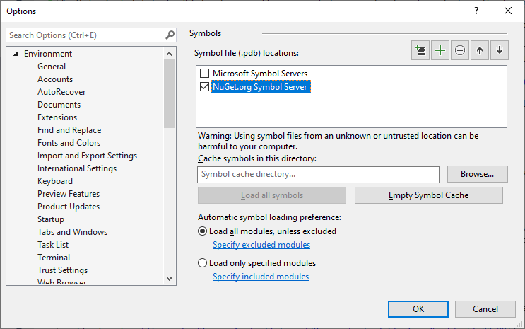

# Debugging with AlterNET UI Sources

While debugging your AlterNET UI application, it may be helpful to *step into* the AlterNET UI source code to better understand 
what is happening under the hood.

Here are the steps required to get AlterNET UI Source debugging working in Visual Studio:

1. Clone or download the [AlterNET UI repository on GitHub](https://github.com/alternetsoft/alternet-ui). Make sure you are using the source
   [tagged](https://github.com/alternetsoft/alternet-ui/tags) with the same version as the version of AlterNET NuGet packages you are using in your
   project.
1. In Visual Studio, open **Tools > Options > Debugging > Symbols** (or **Debug > Options > Symbols**). Under **Symbol file (.pdb) locations**, check **NuGet.org Symbol Server**.

   
1. In Visual Studio, open **Tools > Options > Debugging > General** (or **Debug > Options > General**). Ensure **Enable Just My Code** is unchecked.
1. Start debugging your AlterNET UI application. To ensure the symbols are loaded, open **Debug > Windows > Modules**, 
locate the `Alternet.UI.dll` and other Alternet dlls rows, and select **Load Symbols** in the context menu.
1. After that, executing the **Step Into** command on an AlterNET UI method call will lead to an *open file dialog* prompting to locate an AlterNET UI source
   code file. In that dialog, navigate to the AlterNET UI sources directory you prepared in step 1 and find and select the requested source file there.
1. After the initial setup described in the steps above is done, the AlterNET UI sources will be debugged automatically without any additional actions required.

For additional information on consuming NuGet debug symbols, see
[this MSDN article](https://devblogs.microsoft.com/nuget/improved-package-debugging-experience-with-the-nuget-org-symbol-server/#consume-snupkg-from-nuget-org-in-visual-studio).