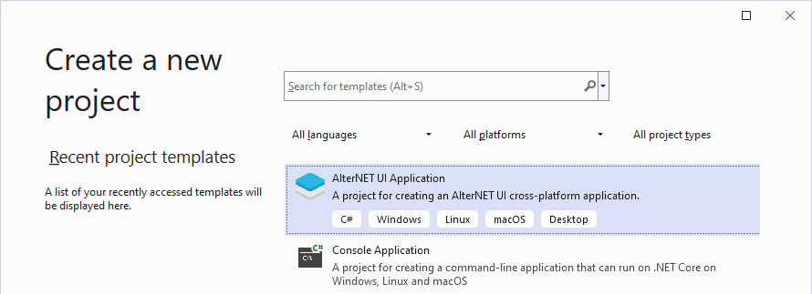

# AlterNET UI Extension for Visual Studio

### To go to the extension build for a specific Visual Studio version click here:
### [Visual Studio 2022](https://marketplace.visualstudio.com/items?itemName=AlternetSoftwarePTYLTD.AlternetUIForVS2022)
### [Visual Studio 2019](https://marketplace.visualstudio.com/items?itemName=AlternetSoftwarePTYLTD.AlternetUIForVS2019)

---
AlterNET UI is a cross-platform .NET UI framework that allows the development of light-footprint .NET desktop applications that runs on **Windows**, **macOS** and **Linux** with Microsoft Visual Studio or Visual Studio Code.

It is is built on top of .NET Framework and uses XAML-like approach to define user interface and layout. It provides a set of standard controls that looks native on the target OS, such as Text Box, Label, CheckBox, Button, Image, TreeViews, ListView and more. 

The framework includes a platform-independent graphic device interface for rendering graphical objects, such as fonts, brushes, images and a layout engine.

For more info, see [alternet-ui.com](https://alternet-ui.com).

